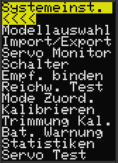
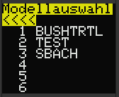
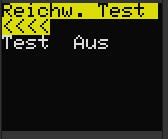
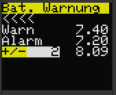

# TXos Bedienungsanleitung

Diese Anleitung beschreibt die TXos Version 0.2.13. (Januar 2023)

---
## Grundsätzliche Bedienung

Die Bedienung erfolgt über einen Drück-Dreh-Steller. Beim Drücken wird zwischen einem kurzen und einem langen Druck (> 300 Millisekunden) unterschieden.

* Drehen - Auswahl der Elemente oder Einstellen eines Wertes
* Kurzer Druck - ENTER
* Langer Druck - CLEAR

Bevor ein Modell programmiert und geflogen wird müssen die Analogeingänge (Kreuzknüppel, Potentiometer und analoge Trimmhebel) kalibriert werden.

---
### Knüppel kalibrierung

Die Funktion zum Kalibrieren der Kreuzknüppel und Potentiometer finden Sie in den Systemeinstellungen.

siehe [Knüppel kalibrierung](#kalibrieren)

---
### Trimm kalibrierung

Die Funktion dazu finden Sie wieder in den Systemeinstellungen.

siehe [Trimm kalibrierung](#trimmung-kal)

---
---
## Display

* Warnmeldungen werden durch CLEAR (Langer Druck) gelöscht.
* Wird keine Meldung angezeigt wird durch einen langen Druck der Timer zurückgesetzt.
* Ein kurzer Druck ruft die Modelleinstellungen aus.

---
---
## Systemeinstellungen

Die Systemeinstellungen sind über den Menüpunkt "Systemeinstellungen" im Modell Menü erreichbar.

---
### Modellauswahl

Ein Arduino mit Mega 2560 Prozessor hat genügend Speicherkapazität für 15 Modelle.

Wählen Sie unter "Modellauswahl" das entsprechende Modell aus und drücken Sie ENTER.

---
### Servo Monitor

Der Servo Monitor zeigt die aktuelle Position aller 9 Servos in Prozent an.

Mit dem Drück-Dreh Steller können Sie nach unten Scrollen um weitere Servos anzuzeigen.

---
### Schalter

Der Schalter Monitor zeigt den aktuellen Zustand aller Schalter an.

Dazu zählen die Hardware-Schalter, sowie logische Schalter und Phasenschalter.

#### Benennung der Schalter

* Hardware Schalter. Die Schalternamen bestehen aus einer Typbezeichnung (BI für 2-Stufen Schalter, TR für 3-Stufen Schalter) und einer fortlaufenden Nummer.
* Geberschalter. Die Schalternamen sind "CS" und eine fortlaufende Nummer.
* Logische Schalter. Logische Schalter sind Verknüpfungen von bis zu 3 anderen Schaltern. Die Schalternamen sind "LS" und eine fortlaufende Nummer.
* Immer EIN Schalter. Dieser Schalter ist fix und kann dazu verwendet werden eine Funktion fest ein zu schalten. Der Name ist "ON". Der Zustand ist immer "1".
* Phasen schalter. "PHA" ist ein 3-Stufen Schalter und wird automatisch entsprechend der aktuellen Flugphase geschalten. "PH1", "PH2" und "PH3" sind 2-Stufen Schalter und mit aktivierung einer Flugphase wird der entsprechende Schalter automatisch geschalten.

Mit dem Drück-Dreh Steller können Sie nach unten Scrollen um weitere Schalter anzuzeigen.

---
### Empf. binden

TXos ünterstützt 2 Relais. Ein Relais dient dazu das HF Modul auszuschalten. Ein weiteres kann einen "Bind" Taster betätigen.

Je nach Sendemodul kann damit von TXos aus der Bindemodus ein- und ausgeschalten werden.

Wählen Sie dazu "Bind" aus und drücken Sie ENTER.

Beim Verlassen dieser Funktion wird aus Sicherheitsgründen ein aktivierter Bind Vorgang abgebrochen.

---
### Reichw. Test

Wenn der "Bind" Taster am Sendemodul einen Reichweiten Test einschaltet kann dies von TXos aus geschehen.

Wählen Sie dazu "Test" aus und drücken Sie ENTER.

Beim Verlassen dieser Funktion wird aus Sicherheitsgründen ein aktivierter Reichweiten Test automatisch beendet.

---
### Mode

Diese Funktion erlaubt die Zuweisung eines Eingangskanals "In1" - "In4" zu die 4 Hauptsteuerfunktionen "Mot", "QR", "HR" und "SR".

Zum Zuweisen eines Einganges zu einer Steuerfunktion wählen Sie die Steuerfunktion an und drücken ENTER.

Durch Drehen wird ein Eingang ausgewählt und duch ENTER bestätigt.

Beim Erstellen einen neuen Modells wird diese Zuordnung als Vorgabe verwendet.

---
### Kalibrieren

Die Kalibrierung legt die Mittelstellung sowie die Endpositionen der Kreuzknüppel und Potertiomenter fest. 

Unkalibrierte Eingänge zeigen einem Minimalwert von 0 und einen Maximalwert von 1023.  
Starten sie die Kalibrierung mit ENTER wenn nachdem Sie "Start" ausgewählt haben.

Das Display zeigt jetzt "CENTER" an. Bewegen Sie alle Kreuzknüppel und Potertiometer in die Mittelstellung.
Danch drücken Sie nochmals ENTER.

Das Display zeigt jetzt "MIN/MAX" an. Bewegen Sie alle Kreuzknüppel und Potertiometer in beide Endstellungen.
Danach drücken Sie ENTER.

Das Display zeigt wieder "CALIB." an. Die Mittelstellung sowie die Endstellungen sind jetzt gespeichert.

---
### Trimmung Kal.

Zur Kalibrierung der Trimmhebel verfahren Sie wie bei der Kalibrierung der Knüppel.

---
### Bat. Warnung

Einstellen der Warn- und Alarmschwellwerte und kalibrierung der gemessenen Batteriespannung.

Wird der Warnschwellwert unterschritten wechselt die Farbe der Batteriespannungs Anzeige von Grün auf Orange.

Wird der Alarmschwellwert unterschritten wechselt die Farbe der Batteriespannungs Anzeige von Orange auf Rot und es ertönt ein Alarmsignal von 5 kurzen Tönen alle 5 Sekunden.

"+/-" ist ein Korrekturwert mit dem die angezeigte Spannung der wahren Batteriespannung angeglichen wird. Dazu sollte die Batteriespannung im Betrieb gemessen und der Korrekturwert entsprechend angepasst werden.

---
---
## Modelleinstellungen

Modelleinstellungen werden pro Modell gespeichert und geladen.

---
### Modell

Das Modul 

---
### Trimmspeicher

---
### Geber Limit

---
### Geber Umkehr

---
### Geberschalter

---
### Schaltkanal

---
### Kanal Zuord.

---
### Kanal Verz.

---
### Phasen

---
### Phasentrimm

---
### Logikschalter

---
### Dual & Expo

---
### Mischer

---
### Motor Aus

---
### Timer

---
### Servo Zuord.

---
### Servo Umkehr

---
### Servo Mitte

---
### Servo Limit

